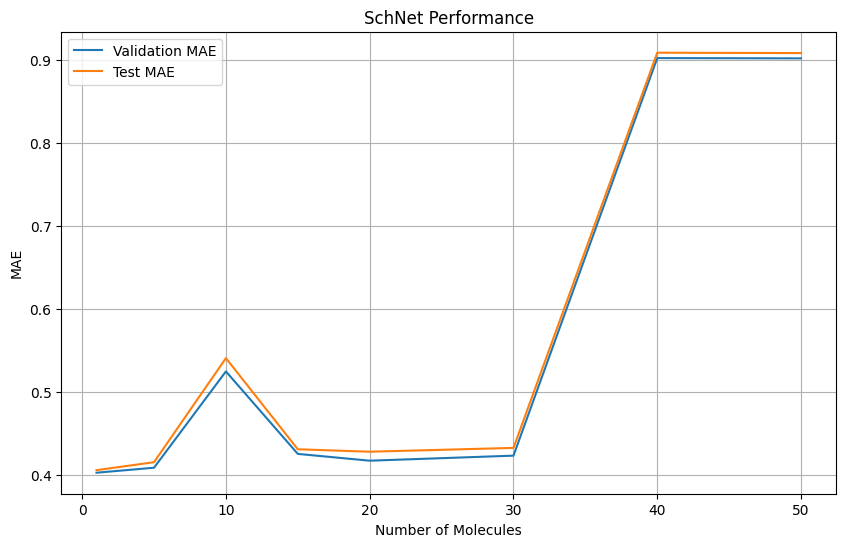

## Introduction

Данный проект представляет собой комплексное исследование в области предсказания ключевых свойств молекул по их структурным характеристикам. Основная цель проекта - разработка и тестирование современных графовых моделей машинного обучения, способных с высокой точностью прогнозировать такие показатели, как токсичность и энергия молекул. Основой для предсказания энергии молекул послужил проект обучения [MEGNet](https://github.com/Gruz2520/predict_energy_of_mols).

Для достижения этой цели были использованы передовые библиотеки и архитектуры нейронных сетей, специализирующиеся на работе с молекулярными данными в графовом представлении:

- Библиотека [DIG (Deep Intuition for Graphs)](https://github.com/divelab/DIG) - комплексный инструментарий для решения широкого спектра задач, связанных с графовыми структурами, включая моделирование молекул.
- Модели [ComENet](https://arxiv.org/abs/2206.08515), [DimeNet++](https://arxiv.org/abs/2011.14115), [SchNet](https://arxiv.org/abs/1706.08566), [SphereNet](https://openreview.net/forum?id=givsRXsOt9r) - передовые архитектуры глубоких нейронных сетей, демонстрирующие высокую производительность в задачах, связанных с молекулярными структурами.

Отличительной особенностью данного проекта стала разработка и применение новых методов аугментации данных и проверка гипотезы о том, что новый метод позволит повысить метрики качества.

В частности, целевыми показателями в этом проекте были:

- Для токсичности - `mouse_intraperitoneal_LD50` (средняя летальная доза для мышей при внутрибрюшинном введении).
- Для энергии - `U_0` (внутренняя энергия молекулы).

## tl;dr:
Новый метод аугментации не дал повышений ключевых метрик. Однако, были обучены и сравнены модели по двум задачам.
### results
|Model|energy_MAE|toxic_MAE|
|-----|---|---|
|MEGNet|**0.0017 meV\atom**|0.5012|
|SchNet|0.0042 meV\atom|0.3985|
|DimeNet++|0.0066 meV\atom|0.3887|
|ComENet|0.0031 meV\atom|0.3980|
|SphereNet|0.0027 meV\atom|**0.3756**|

Для энергии MEGNet смог обойти всех по точности на атом, благодаря своей легковестности. 

Для определения токсичности мы не гнались за точностью, хоть и обогнали [PassOnline](https://passonline.org/) 0.5 vs **0.3756** [Our SphereNet](scripts_for_train_on_cluster/sphere_100.py), который является лидером у медиков для рассчета свойств соединений. Мы определяли работоспособность нового способа аугментации данных. Поэтому мы обучали каждую из моделей и увеличивали количество вариаций каждой из молекул:

К сожалению при увеличении количества молекул мы не получали улучшений точности, поэтому туть график только одной из всех моделей.

## Repository Architecture
В репозитории выложены основные скрипты для обучения, ноутбуки анализа данных с их предобработкой. Датасет, обученные модели, скрипты запуска `sbatch` для постановки задачи обучения на кластере и т.д. не выложены.

- [predict_energy.ipynb](predict_energy.ipynb) - основной ноутбук с вычислениями для датасета с энергией молекул и подготовки данных для обучения.
- [predict_toxic.ipynb](predict_toxic.ipynb) - основной ноутбук с вычислениями для датасета с токсичностью молекул и подготовки данных для обучения.
- [test_model_setups_notebooks](test_model_setups_notebooks) - перед обучением тестировал разные сетапы моделей на маленьких выборках для подбора гиперпараметров обучения.
- [scripts_for_train_on_cluster](scripts_for_train_on_cluster) - лежат скрипты, для параллельного запуска обучения моделей на кластере.
  - [tts.py](scripts_for_train_on_cluster/tts.py) - занимался декомпозицией скриптов для создания кастомных train_test_split, так как тестировались несколько вариаций разбиения.
  - [utils.py](scripts_for_train_on_cluster/utils.py) - выделил основные функции предобработки данных для простоты изменения.

## Requirements
При создании среды требуется собирать `torch` из бинарных файлов, иначе не будет определяться GPU для обучения.

```bash
pip install -r req.txt
```